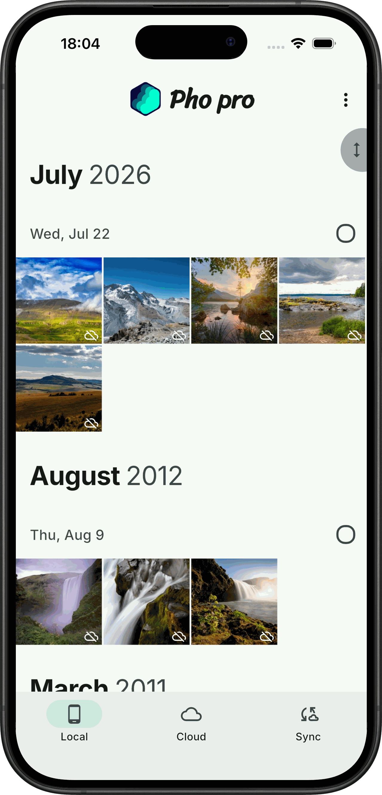
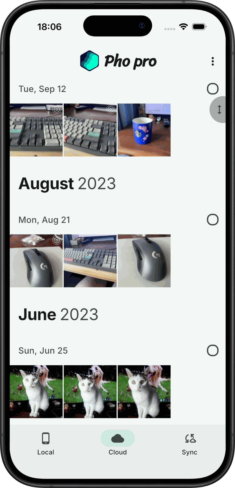
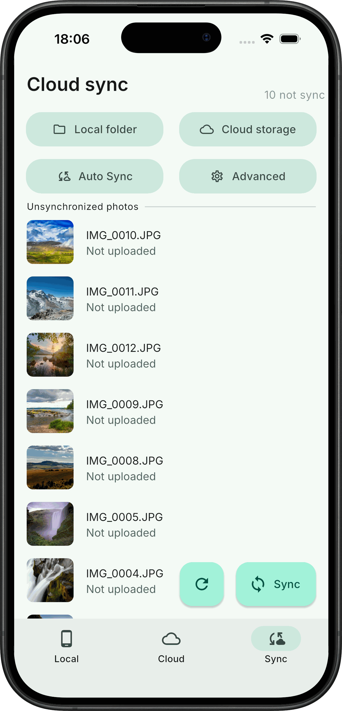
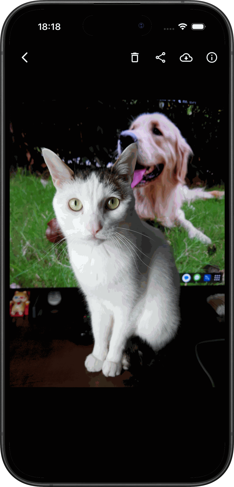

<br/><br/><p align="center">

</p>
<h3 align="center">
Pho — 无服务端的照片浏览与同步应用
</h3>
<p align="center">
  
</p>
<p align="center">
  <a href="README.md">中文</a> | <a href="README_EN.md">English</a>
</p>

### 简介

Pho 用于替代手机自带相册：既能浏览本地与网络存储上的照片，也能把照片增量同步到你自己的网络存储。

应用不依赖服务端、不建数据库、不需要账号。照片按时间组织成目录、直接存放在你的存储设备上，应用只负责读写这些目录——你随时可以脱离它管理自己的照片。

### 下载

Android 安装包见 [Releases](https://github.com/ZenithLiteAura/Pho_Community/releases)。

### 功能特性

- **本地相册**：按日期分组浏览，网格列数可调，支持缩放查看、视频播放与实况照片
- **云端相册**：直接浏览网络存储上的照片，无需先把整库下载到本地
- **增量同步**：以内容哈希、存储文件名、本地路径三重比对去重，已上传的照片不会重复上传
- **并行上传**：1–10 路并发可调（设置 → 同步设置 → 同步性能）
- **存储即数据库**：目录按时间组织，照片可用任意工具直接访问，不绑定本应用
- **缩略图缓存**：根目录下的 `.thumbnail` 镜像源文件结构，加速浏览
- **外观与主题**：MIUIX / Material 3 双主题、深色模式、Dock 风格与透明度、相册列数
- **日志与诊断**：日志采集、分级过滤与导出，便于排查同步问题
- **多平台**：Android / iOS / macOS

### 支持的存储

- [x] Samba（SMB）
- [x] WebDAV（支持主存储 + 备份存储双目标）
- [x] NFS
- [ ] OneDrive / Google Drive / 阿里云盘

### 截图

<p align="left">




</p>

### 文件存储结构

文件按时间组织目录、以文件名存放源文件；根目录下的 `.thumbnail` 存放缩略图，结构与之镜像。你可以随时用其它方式取用这些照片，不需要依赖本应用。

```bash
├── 2022
│   ├── 07
│   │   ├── 02
│   │   │   ├── 20220702_100940.JPG
│   │   │   ├── 20220702_111416.JPG
│   │   │   └── 20220702_111508.JPG
│   │   └── 03
│   │       ├── 20220703_101923.DNG
│   │       ├── 20220703_112336.DNG
│   │       └── 20220703_112338.DNG
├── 2023
│   └── 01
│       └── 03
│           ├── 20230103_112348.JPG
│           ├── 20230103_124634.JPG
│           └── 20230103_124918.DNG
└── .thumbnail
    └── 2022
        └── 07
            ├── 02
            │   ├── 20220702_100940.JPG
            │   ├── 20220702_111416.JPG
            │   └── 20220702_111508.JPG
            └── 03
                ├── 20220703_101923.DNG
                ├── 20220703_112336.DNG
                └── 20220703_112338.DNG
```

### 构建

#### 环境要求

- Flutter 3.41.4 (stable) / Dart 3.11.1
- Go 1.25（toolchain go1.25.4）
- JDK 17
- Android SDK：compileSdk 36
- Android NDK：用于构建嵌入式 Go 服务端（gomobile bind）
- protoc 及插件：protoc-gen-go@v1.27.1、protoc-gen-go-grpc@v1.1.0、protoc_plugin@21.1.2 (Dart)

#### 构建步骤

```bash
# 1. 生成 protobuf 代码（Go + Dart）
make prebuild
make protobuf

# 2. 构建嵌入式 Go 服务端
make server-aar      # Android -> android/app/libs/server.aar（需 gomobile）
make server-ios      # iOS     -> ios/Frameworks/RUN.xcframework
make server-linux    # Linux   -> linux/lib/run.so
make server-windows  # Windows -> windows/lib/run.dll

# 3. 构建应用
make apk             # Android APK
make ipa             # iOS IPA

# 4. 运行测试（SMB / WebDAV / NFS 用例需要 Docker 容器）
make test
```

> `flutter run` 不会自动构建 `android/app/libs/server.aar`，需先执行 `make server-aar`，否则嵌入式 Go 服务端无法启动。

### 未来规划

- [ ] 更多网盘后端（OneDrive / Google Drive / 阿里云盘）
- [ ] 桌面端（Windows / Linux）完善
- [ ] 同步冲突处理与断点续传
- [ ] 按时间、地点自动聚合与智能分类
- [ ] 超大相册滚动性能持续优化
- [ ] 多存储目标同时写入（不止主 + 备份）
- [ ] 同步状态的更细粒度提示

### 贡献

欢迎在 Issue 中反馈问题或提出建议，也欢迎直接提交 Pull Request。

### 许可证

本项目采用 [GNU General Public License v3.0](LICENSE) 许可证。