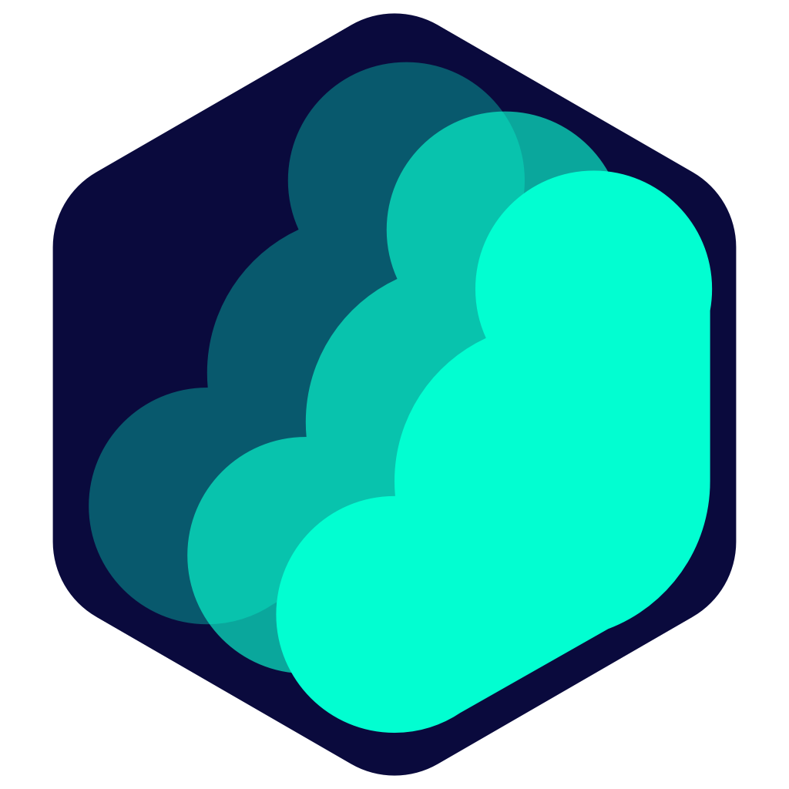

<br/><br/><p align="center">

</p>
<h3 align="center">
Pho — a serverless photo browser and sync app
</h3>
<p align="center">
  
</p>
<p align="center">
  <a href="README.md">中文</a> | <a href="README_EN.md">English</a>
</p>

### Introduction

Pho is meant to replace the built-in gallery on your phone: browse photos stored locally or on your network storage, and incrementally sync them to storage you own.

There is no server, no database and no account. Photos are organized into date-based directories and live directly on your storage device — the app only reads and writes those directories, so you can always manage your photos without it.

### Download

See [Releases](https://github.com/ZenithLiteAura/Pho_Community/releases) for the Android APK.

### Features

- **Local gallery**: browse grouped by date, adjustable grid columns, pinch-to-zoom, video playback and Live Photos
- **Cloud gallery**: browse photos on your network storage directly, without downloading the whole library first
- **Incremental sync**: three-way deduplication by content hash, stored filename and local path — nothing is uploaded twice
- **Parallel upload**: 1–10 concurrent uploads, configurable (Settings → Sync → Performance)
- **Storage as the database**: date-based directory layout, readable by any other tool, no lock-in
- **Thumbnail cache**: a `.thumbnail` directory mirroring the source tree keeps browsing fast
- **Look and feel**: MIUIX / Material 3 themes, dark mode, Dock style and opacity, gallery column count
- **Logs and diagnostics**: log collection, level filtering and export to help trace sync issues
- **Platforms**: Android / iOS / macOS

### Supported storage

- [x] Samba (SMB)
- [x] WebDAV (primary + backup target)
- [x] NFS
- [ ] OneDrive / Google Drive / Alibaba Cloud Drive

### File storage layout

Source files are stored by filename under date-based directories. Thumbnails live in a `.thumbnail` directory at the root, mirroring the same structure. You are free to use the uploaded photos in any other way — no dependency on this app.

```bash
├── 2022
│   ├── 07
│   │   ├── 02
│   │   │   ├── 20220702_100940.JPG
│   │   │   ├── 20220702_111416.JPG
│   │   │   └── 20220702_111508.JPG
│   │   └── 03
│   │       ├── 20220703_101923.DNG
│   │       ├── 20220703_112336.DNG
│   │       └── 20220703_112338.DNG
├── 2023
│   └── 01
│       └── 03
│           ├── 20230103_112348.JPG
│           ├── 20230103_124634.JPG
│           └── 20230103_124918.DNG
└── .thumbnail
    └── 2022
        └── 07
            ├── 02
            │   ├── 20220702_100940.JPG
            │   ├── 20220702_111416.JPG
            │   └── 20220702_111508.JPG
            └── 03
                ├── 20220703_101923.DNG
                ├── 20220703_112336.DNG
                └── 20220703_112338.DNG
```

### Build

#### Requirements

- Flutter 3.41.4 (stable) / Dart 3.11.1
- Go 1.25 (toolchain go1.25.4)
- JDK 17
- Android SDK: compileSdk 36
- Android NDK: required to build the embedded Go server (`gomobile bind`)
- protoc and plugins: protoc-gen-go@v1.27.1, protoc-gen-go-grpc@v1.1.0, protoc_plugin@21.1.2 (Dart)

#### Steps

```bash
# 1. Generate protobuf code (Go + Dart)
make prebuild
make protobuf

# 2. Build the embedded Go server
make server-aar      # Android -> android/app/libs/server.aar (needs gomobile)
make server-ios      # iOS     -> ios/Frameworks/RUN.xcframework
make server-linux    # Linux   -> linux/lib/run.so
make server-windows  # Windows -> windows/lib/run.dll

# 3. Build the app
make apk             # Android APK
make ipa             # iOS IPA

# 4. Run tests (SMB / WebDAV / NFS cases need Docker containers)
make test
```

> `flutter run` does not build `android/app/libs/server.aar` automatically — run `make server-aar` first, otherwise the embedded Go server cannot start.

### Roadmap

- [ ] More cloud backends (OneDrive / Google Drive / Alibaba Cloud Drive)
- [ ] Polished desktop support (Windows / Linux)
- [ ] Sync conflict handling and resumable transfers
- [ ] Automatic grouping and smart classification by time and place
- [ ] Continued scrolling performance work for very large galleries
- [ ] Writing to multiple storage targets at once (beyond primary + backup)
- [ ] More granular sync status reporting

### Contributing

Issues and suggestions are welcome — pull requests are welcome too.

### License

Licensed under the [GNU General Public License v3.0](LICENSE).